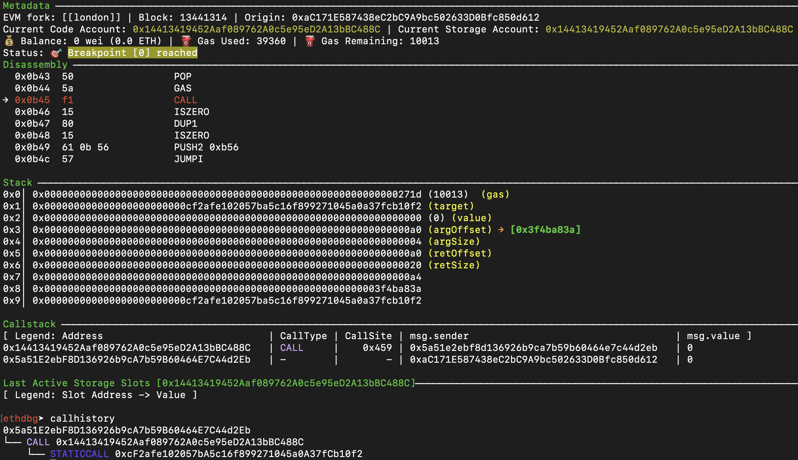

# ♦ ethpwn - EVM Hacking on Steroids #
[](https://github.com/ethpwn/ethpwn/blob/main/LICENSE)  [](https://github.com/ethpwn/ethpwn)  [](https://pypi.org/project/ethpwn/)
  


`ethpwn` is a project inspired by the widely popular CTF exploitation framework [`pwntools`](https://github.com/Gallopsled/pwntools), and the amazing enhanced GDB utility [`GEF`](https://github.com/hugsy/gef/) by [@hugsy](https://github.com/hugsy).
In other words, `ethpwn` is all you ever wanted for debugging and interacting with smart contracts on EVM-based blockchains.

The project started due to the frustration of [@honululu](https://twitter.com/dreselli) and [@degrigis](https://twitter.com/degrigis), when trying to debug exploits for the [ethernaut](https://ethernaut.openzeppelin.com/) challenges.
With `ethpwn`, we hope to improve educational capabilities when it comes to smart contract and blockchain analysis, and facilitate research efforts in the area.

Currently, `ethpwn` is a package that ships a set of handy wrappers for the `web3` Python package (in pwntools style!), and a CLI debugger --`ethdbg`-- that allows users to set breakpoints, inspect memory, storage (and more!) in a GDB-like interface. It even automatically pulls verified source-code from [Etherscan](https://etherscan.io/) if it can find it!

`ethpwn` requires *Python3*.



| ⚠️ <span style="color: red;">WARNING</span> ⚠️                             |
|------------------------------------------|
|`ethpwn` is optimized for ease-of-use. e.g., we aggresively over-allocates the gas price for transactions to ensure that they are mined quickly. This decision works well for CTF challenges, but can be a problem if you are using `ethpwn` to interact with real contracts on the mainnet (i.e., it can cause a massive overpay in terms of transaction fee). DO NOT USE `ethpwn` TO INTERACT WITH REAL CONTRACTS ON THE MAINNET UNLESS YOU ARE ABSOLUTELY SURE WHAT YOU ARE DOING. |


## ⚡️ Quick Start

#### Installation
To start with `ethpwn`, you only need *Python3*, we will take care of the rest.

You can verify your *Python* version with:

```bash
hacker@eth:~$ python3 --version
Python 3.8.10
```


We strongly suggest that you create a *Python3* [virtual environment](hhttps://opensource.com/article/21/2/python-virtualenvwrapper) before proceeding.

Once you have done that, just:

```bash
pip install ethpwn
```

#### Developer Installation
If you want to install `ethpwn` in developing mode (i.e., editable in the current folder), first: Make sure you have the latest version of `pip`:

```bash
hacker@eth:~$ pip --version
pip 23.1.2
```

Then, just:

```bash
git clone git@github.com:ethpwn/ethpwn.git && pip install -e ethpwn
```

#### RPC Node
Assuming that you want to work with Ethereum mainnet, you will need access to an Ethereum RPC node:

##### Custom RPC node
If you have your own node, just grab the RPC endpoint address and you are good to go.
The link you will get is something like:
`ws://192.168.1.1:8546`.

##### Public RPC node

If you do not have an Ethereum node, or you simply do not want to use your own, you can easily get access to a public one by using a service like [Infura](https://www.infura.io/) or [Alchemy](https://www.alchemy.com/overviews/rpc-node).
These providers offer a free tier for accessing the RPC nodes of many different blockchains (e.g., Ethereum, Sepolia, Avalanche) which is sufficient for our purposes.

The link you will get should look something like: `https://mainnet.infura.io/v3/38eb4be006004da4a89315232040e222`.

| ⚠️ Warning                               |
|------------------------------------------|
| While these providers offer public nodes access, the RPC URL is generated per-user. DO NOT spread the obtained URL on the internet or people will start to make requests using your account and you will quickly run out of queries (i.e., the free tier is rate-limited, but it's totally enough for using `ethpwn` in a normal work-day). |


## 🚀 Run

To try out `ethdbg`, a simple way of debugging a transaction that happened on the Ethereum mainnet is:

```bash
ethdbg --txid 0x82a11757c3f34c2882e209c6e5ae96aff3e4db7f7984d54f92b02e1fed87e834 --node-url https://mainnet.infura.io/v3/38eb4be006004da4a89315232040e222
```

To learn more about the debugging features available in `ethdbg`, and all the functionalities offered by `ethpwn`, please refer to their respective pages.


## 🐛 Bugs & Feedbacks
For any bugs and feedback please either open an issue on our [Github repository](https://github.com/ethpwn/ethpwn), or, even better, a pull request!
Please keep in mind this is a tool developed for fun in our spare time, while we will try to maintain it, we currently cannot commit to regular releases and bug fixes.

## 🛠️ Contributions
`ethpwn` is currently mainly maintained by [degrigis](https://github.com/degrigis) and [honululu](https://github.com/Lukas-Dresel) and the following contributors:


